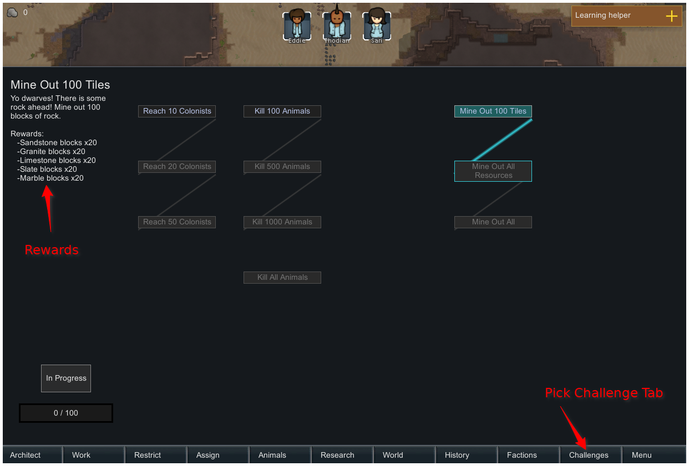

[Steam Workshop Page](https://steamcommunity.com/sharedfiles/filedetails/?id=1382592596)

Mod adds challenge choice to the [RimWorld](https://rimworldgame.com/) game. 

Challenge is a condition in game that you have to complete.

It adds a button in bottom button line called "Challenges", click on it to open challenge choice menu.

It is under development for now, so has just few challenges to play with. I collect all challenge ideas for potential implemeting [here](Challenges.md).

