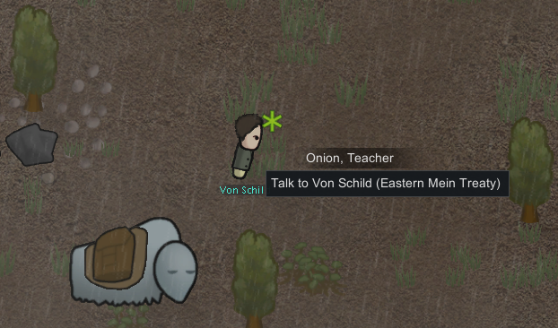

[Steam Workshop Page](https://steamcommunity.com/sharedfiles/filedetails/?id=1382592596)

Mod adds challenge concept to the [RimWorld](https://rimworldgame.com/) game. 

Challenge is a condition in game that you have to complete. Like "Kill 100 animals" or "Create a masterpiece sculpture". Challenges are meant to be not easy, and you are rewarded for completing them.

Completed challenges are remembered by game and not available for choice in any storyline. You can reset completed challenges back via mod settings menu.

## Incoming Challenge Message

If you don't have active challenge, you may receive incoming radio message from one of the factions around. You can accept or reject it.

## Challenge Bringer

Each traveler group that passes by will have a person with asterisk pulsing, which is a challenge giver sign. Talk to challenge giver if you want to change your current challenge.

## Challenges Overview Tab
It adds a button in bottom button line called "Challenges", click on it to open challenge view, where you can see possible challenges and their status.

## Help Improving 

It is under development for now, so has just few challenges to play with. I collect all challenge ideas for potential implemeting [here](Challenges.md). Bring your feedback about challenge/reward balance to me, it will help improving the mod.
