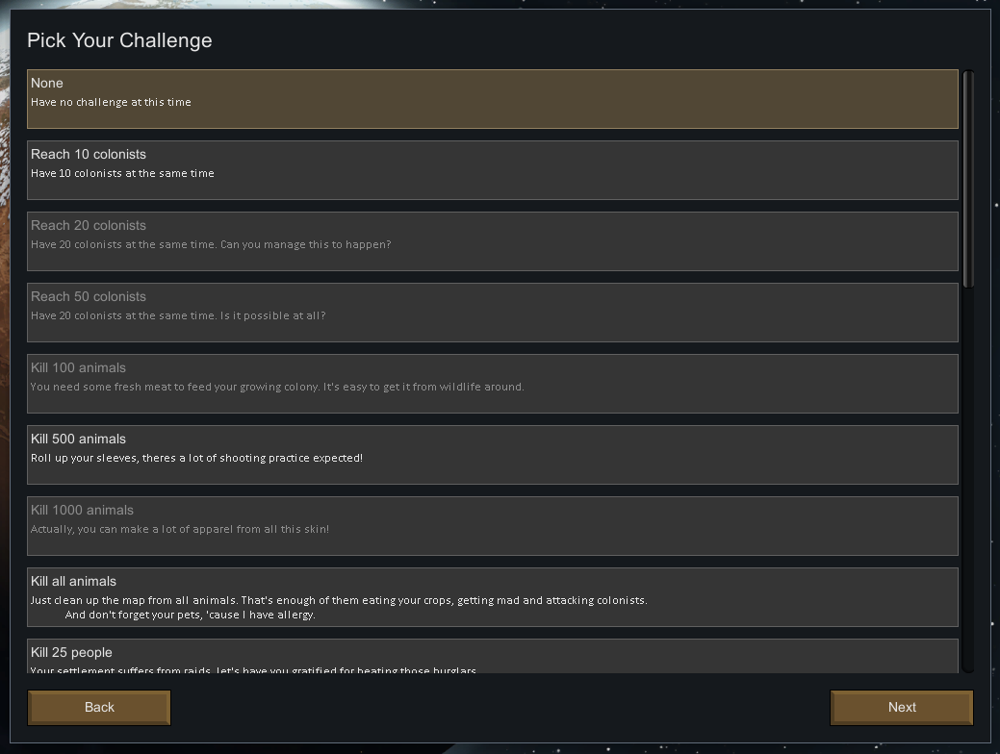

[Steam Workshop Page](https://steamcommunity.com/sharedfiles/filedetails/?id=1382592596)

Mod adds challenge concept to the [RimWorld](https://rimworldgame.com/) game. 

Challenge is a condition in game that you have to complete. Like "Kill 100 animals" or "Create a masterpiece sculpture". Challenges are meant to be not easy, and you are rewarded for completing them.

Completed challenges are remembered by game and not available for choice in any storyline. You can reset completed challenges back via mod settings menu.

## Picking a Challenge

Once you have this mod enabled, you will be offered a list of challenges to choose from. This list will appear after choosing landing site on world map. Some of challenges can only be chosen if your landing site has biome or terrain. Unavailable and complete challenges will be grayed out.

## Completing The Challenge

Once you have active challenge, you will see small alert on the right, helping to track your challenge progress. You can move mouse over that alert to get some more details:

Finally, when your challenge is complete, the game will offer you to quit to menu, or continue playing with reward given to your colonists.

## Help Improving 

It is under development for now, so has just few challenges to play with. I collect all challenge ideas for potential implemeting [here](Challenges.md). Bring your feedback about challenge/reward balance to me, it will help improving the mod.
